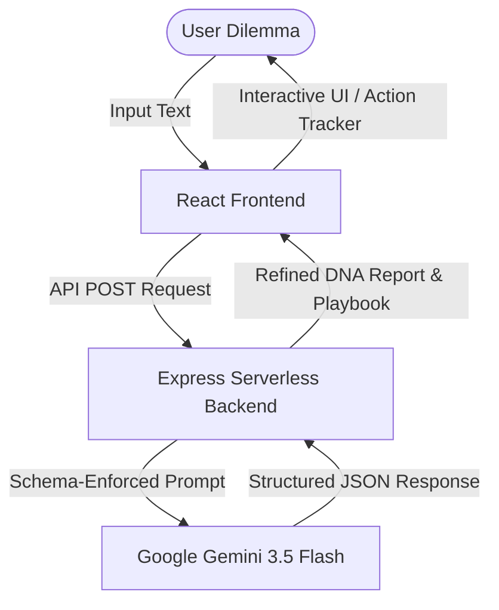

# 🧠 ALAYA

### *Confusion → Clarity → Action*
**Your AI-Powered Decision Intelligence Partner for Life's Biggest Compromises**

Alaya is a cognitive-behavioral Decision Intelligence System designed to help individuals navigate uncertainty, overcome analysis paralysis, and formulate risk-free validation experiments. Instead of telling users what to choose, Alaya maps their subconscious priorities, uncovers hidden cognitive biases, simulates future scenarios, and helps them move confidently from confusion to clear action.

Built for the **Build the Second Brain for Real Life** Hackathon.

---

## 🚀 Live Demo & Presentation

> [!IMPORTANT]
> **Before Hackathon Submission:** Remember to replace the placeholder links below with your final links!

<div align="center">
  <a href="https://alaya-615514915536.asia-southeast1.run.app/">
    
  </a>
  <a href="https://youtube.com/your-video">
    
  </a>
  <a href="https://drive.google.com/file/d/115_ZLM7jIf2W-4TsolkDDek2t-WZ9trs/view?usp=sharing">
    
  </a>
</div>

> [!NOTE]
> The live application is fully functional and deployed live. Due to Google Gemini free-tier API rate limits, the live demo may occasionally become temporarily unavailable after heavy usage. A complete walkthrough video is included to demonstrate the full user experience and all features.

---

## 🛠️ Tech Stack & Integrations

Alaya is built using a modern, lightweight, and high-performance serverless stack:

* **Frontend:**    
* **Backend:**   
* **AI Engine:** 
* **Deployment:** 

---

## ✨ Key Features

### 🧬 Decision DNA Analysis
Extracts core values, priorities, constraints, and custom cognitive styles (e.g. *Analytical Dreamer*) from natural language descriptions of life decisions.

### ⚖️ Dynamic Tradeoff Mapping
Compares options side-by-side using numerical metrics (Risk, Growth, Income, Learning, Flexibility) accompanied by key Pros and Cons.

### 🔍 Cognitive Bias Detection
Identifies underlying blockers (e.g. Sunk Cost Fallacy, Loss Aversion, Perfectionism, FOMO) that keep users stuck in analysis paralysis.

### 📅 Action Protocol Playbook
Generates a structured, risk-free validation roadmap consisting of:
* **7-Day Plan:** Information gathering and initial conversations.
* **14-Day Plan:** Active trial / validation experiment (including target metrics and concrete actions).
* **30-Day Plan:** Threshold limits and commitment checks.

---

## 🏗️ System Architecture

Alaya leverages a serverless architecture where the static React frontend is served via Vercel's global CDN, and the backend routes API requests dynamically to Vercel Serverless Functions.



---

## 🤖 Google Gemini API Engine

Alaya is powered by the **Google Gemini 3.5 Flash** model using the new `@google/genai` SDK. To guarantee high reliability and type-safety in the frontend, the serverless backend enforces strict **JSON Schemas** directly at the API gateway level:

```typescript
// Enforcing a strict schema constraint for the Gemini API call in server.ts
const response = await ai.models.generateContent({
  model: "gemini-3.5-flash",
  contents: prompt,
  config: {
    responseMimeType: "application/json",
    responseSchema: {
      type: Type.OBJECT,
      properties: {
        coreValues: {
          type: Type.ARRAY,
          items: {
            type: Type.OBJECT,
            properties: {
              value: { type: Type.STRING },
              explanation: { type: Type.STRING },
              importance: { type: Type.INTEGER }
            },
            required: ["value", "explanation", "importance"]
          }
        },
        decisionStyle: {
          type: Type.OBJECT,
          properties: {
            style: { type: Type.STRING },
            description: { type: Type.STRING }
          },
          required: ["style", "description"]
        },
        // Additional properties for hiddenBlockers, tradeoff comparisons, scenarios, and plans
      },
      required: ["coreValues", "decisionStyle", "hiddenBlockers", "optionsCompared", "biasAnalysis", "futureScenarios", "suggestedActionPath", "confidenceLevel"]
    }
  }
});
```

---

## 🛡️ Responsible AI Principles

Alaya adheres strictly to **Responsible AI** development practices:
* **Human-in-the-Loop:** Alaya acts as an analyzer and cognitive guide. It *never* makes choices for the user or recommends a specific option.
* **Confidence Indicators:** Calculates a priority confidence index based on user inputs.
* **Explicit Disclaimers:** Provides permanent access to an interactive disclosure modal outlining the limits of AI-generated advice.

---

## ⚙️ Local Development Setup

Follow these instructions to run the application locally on your computer:

### 1. Prerequisites
Ensure you have [Node.js](https://nodejs.org/) installed (v18.0.0 or higher).

### 2. Clone and Install Dependencies
```bash
git clone https://github.com/utkarshtiwarri/Alaya.git
cd Alaya
npm install
```

### 3. Configure Environment Variables
Copy the env template file to `.env`:
```bash
# On Windows PowerShell:
copy .env.example .env

# On macOS/Linux:
cp .env.example .env
```
Open `.env` in a text editor:
* **To run with AI (Live Mode):** Add your Google Gemini API key:
  ```env
  GEMINI_API_KEY="AIzaSyYourGeminiApiKeyHere"
  ```
* **To run without AI (Mock Mode):** If you do not have an API key and want to test the UI flow immediately, add:
  ```env
  MOCK_MODE=true
  ```

### 4. Run the Development Server
```bash
npm run dev
```
Open your browser and navigate to **`http://localhost:3000`**. The local server will hot-reload automatically as you edit the code.

---

## 📂 Project Structure

```text
Alaya/
├── api/                # Vercel serverless function entrypoint
│   └── index.ts        
├── src/                # Frontend React code
│   ├── components/     # UI components (Values DNA, Scenario Simulator, etc.)
│   ├── types.ts        # TypeScript declarations
│   ├── App.tsx         # Main application coordinator
│   └── index.css       # Core styling & Tailwind imports
├── server.ts           # Express backend endpoints & Vite dev server configuration
├── vercel.json         # Vercel routing rules
├── package.json        
└── README.md           
```
