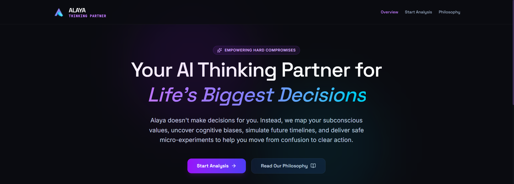
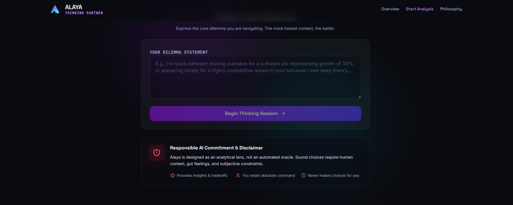
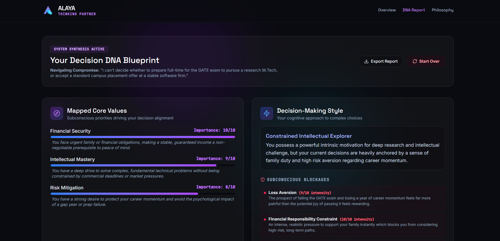
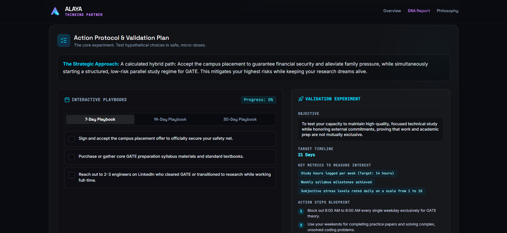

# 🧠 ALAYA

## Your AI Thinking Partner for Life's Biggest Decisions

Alaya is an AI-powered Decision Intelligence System designed to help people navigate uncertainty, overcome decision paralysis, and take meaningful action.

Instead of telling users what to choose, Alaya helps them understand **why they are stuck**, identify hidden blockers, evaluate tradeoffs, and move from confusion to clarity.

---

# 🚀 Problem

People face important decisions every day:

* Higher Studies vs Employment
* Entrepreneurship vs Stability
* Career Changes
* Relocation Decisions
* Skill Development Paths
* Personal Growth Opportunities

While information is abundant, clarity is not.

People often struggle with:

* Information overload
* Conflicting advice
* Hidden fears and biases
* Uncertainty about outcomes
* Analysis paralysis

The problem is not a lack of information.

**The problem is a lack of clarity.**

---

# 💡 Solution

Alaya transforms decision-making into a structured reasoning process.

Users describe their dilemma in natural language, and Alaya helps them:

* Understand their priorities
* Identify hidden concerns
* Explore tradeoffs
* Surface potential biases
* Generate actionable next steps

The goal is not to replace human judgment.

The goal is to strengthen it.

---

# ✨ Core Features

## Decision DNA Analysis

Analyze:

* Core Values
* Priorities
* Constraints
* Decision Style

---

## Tradeoff Mapping

Compare options across:

* Risk
* Growth
* Stability
* Learning
* Opportunity Cost

---

## Hidden Blocker Detection

Surface possible blockers such as:

* Fear of Failure
* Analysis Paralysis
* Social Pressure
* Perfectionism
* Fear of Missing Out

---

## Action Protocol Generator

Generate structured plans such as:

* 7-Day Action Plan
* 14-Day Validation Plan
* 30-Day Exploration Plan

---

## Human-in-the-Loop Design

Alaya provides insights and recommendations.

Final decisions always remain with the user.

---

# 🎥 Demo

## Live Demo

https://alaya-nine.vercel.app

## AI Model

Google Gemini API powers:

- Follow-up questioning
- Value extraction
- Bias detection
- Decision DNA generation
- Action protocol generation

## Demo Video

https://youtube.com/your-video

## Presentation

https://drive.google.com/file/d/115_ZLM7jIf2W-4TsolkDDek2t-WZ9trs/view?usp=sharing

---

# 🖼️ Screenshots

## Landing Page


## Decision Analysis



## Decision DNA Report



## Action Protocol



---

# 🧭 How to Use

### Step 1

Open Alaya in your browser.

### Step 2

Describe your dilemma.

Example:

> I am confused between pursuing higher studies, accepting a job offer, or starting my own business.

### Step 3

Answer the AI-generated follow-up questions.

### Step 4

Review your Decision DNA Report.

### Step 5

Understand your values, tradeoffs, and hidden blockers.

### Step 6

Follow the recommended action protocol.

### Step 7

Make a more informed and confident decision.

---

# 🏗️ Architecture

```text
User Dilemma
      ↓
Natural Language Processing
      ↓
Value Extraction
      ↓
Tradeoff Analysis
      ↓
Bias Detection
      ↓
Decision Intelligence Engine
      ↓
Decision Report
      ↓
Action Protocol
```

---

# 🛡️ Responsible AI

Responsible AI is a core design principle of Alaya.

## Potential Risk

Users may over-rely on AI-generated insights.

## Mitigation Strategies

* Confidence Indicators
* Transparent Reasoning
* Multiple Perspectives
* Alternative Interpretations
* Human-in-the-Loop Oversight

## Important

Alaya does not make decisions on behalf of users.

The final decision always remains under human control.

---

# 🛠️ Tech Stack

## Frontend

* React
* TypeScript

## Backend

* Express.js
* Node.js

## AI

* Google Gemini API

---

# 📂 Project Structure

```text
alaya/
├── src/
│   ├── components/
│   ├── App.tsx
│   └── ...
├── server.ts
├── package.json
└── README.md
```

---

# ⚙️ Local Development

The app is live, so users can access the demo directly from the deployment link above.

# 🔍 Example Use Cases

### Education

* Choosing a degree path
* Studying abroad
* Exam preparation decisions

### Career

* Job switching
* Offer evaluation
* Career planning

### Entrepreneurship

* Startup validation
* Business opportunity analysis
* Growth decisions

### Personal Life

* Relocation choices
* Goal prioritization
* Long-term planning

---

# 🌟 Vision

We envision Alaya becoming a lifelong Decision Intelligence Companion that helps people make better decisions, navigate uncertainty, and develop stronger decision-making skills over time.

---

# 📌 Tagline

### Confusion → Clarity → Action

### Alaya — Your AI Thinking Partner for Life's Biggest Decisions.

---

# 👨‍💻 Team

**Steel Brains**

Built for the **Build the Second Brain for Real Life** Hackathon.
